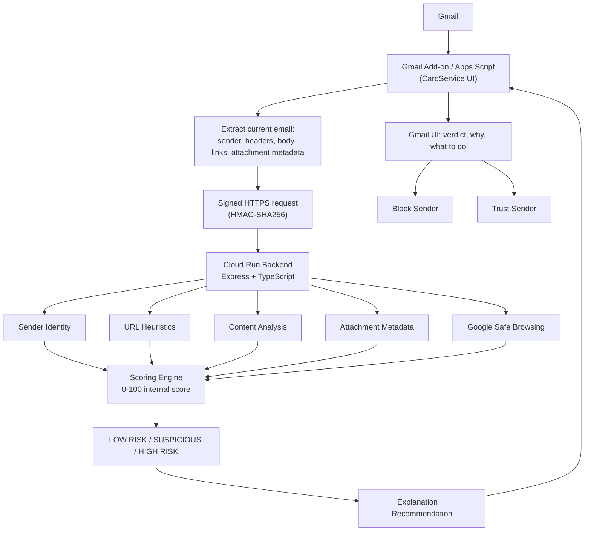

#  InboxGuard

[](https://github.com/noambendor1/InboxGuard/actions/workflows/backend-ci.yml)

InboxGuard is a Gmail Add-on that looks at the email you currently have open and tells you, in plain language, whether it looks risky, why, and what to do about it — a Google Apps Script Add-on (thin client) backed by a Node.js/TypeScript service that does the actual analysis, with Google Safe Browsing folded in as one signal among several.

For a deeper explanation of the architecture and technical decisions, see [`docs/ARCHITECTURE_AND_DECISIONS.md`](docs/ARCHITECTURE_AND_DECISIONS.md). To demo it on a real Gmail account, see [`docs/DEMO.md`](docs/DEMO.md).

---

## What the user sees

InboxGuard's sidebar answers three questions: **Does this look risky? Why? What should I do?** It shows one of three levels — **LOW RISK**, **SUSPICIOUS**, **HIGH RISK** — with the top reasons in plain language and one specific recommended action, then lets you **block the sender** or tell InboxGuard **you trust this sender**.

A real, live-tested result (`docs/DEMO.md` Scenario 3) for a payment scam email:

<p>
  
  
</p>

---

## What I chose to build, and why

**Risk levels, not a number.** "82/100" implies a precision this system doesn't have — it's a weighted heuristic total, not a calibrated probability. LOW RISK / SUSPICIOUS / HIGH RISK communicates exactly as much certainty as actually exists, and is something anyone can act on immediately. The backend still computes a 0–100 score internally (useful for ranking findings and picking thresholds) — it's an implementation detail, never shown to the user.

**Explainability over a bare verdict.** "HIGH RISK, trust us" isn't verifiable. Every finding carries a plain-language explanation and a technical one, plus a specific recommended action tied to the strongest finding — "don't enter your password via this link," not "be careful."

**Safe Browsing combined with local heuristics, not either alone.** Safe Browsing confirms URLs Google has already seen; it says nothing about one registered five minutes ago. Structural checks (IP hosts, punycode, shorteners, link-text/href mismatches) catch what reputation hasn't indexed yet. Neither is sufficient by itself.

**Attachments: metadata only.** Opening or executing attachment content is itself a security risk and out of scope for an MVP. Filename, extension, MIME type, and size already catch the classic disguised-executable pattern (`invoice.pdf.exe`) without touching the file's bytes.

**No LLM.** An LLM reading raw email content is a prompt-injection surface — the content being analyzed is written by a stranger who can try to manipulate the model itself. Deterministic rules have no such attack surface, are free to run, and are trivially testable. (Referenced again under Trade-offs and Future Improvements below — this is the one full explanation.)

**Block and Trust as the two user actions.** Telling someone "this is dangerous" without giving them something to do leaves them stuck. Trusting a sender reduces the Add-on's own low-confidence noise (see `addon/src/TrustedSenderStore.js`) but **never** suppresses a confirmed Safe Browsing match, a dangerous attachment, or a strong link/content finding — because a trusted contact's account can be compromised, and that's exactly the case InboxGuard needs to still catch.

---

## Architecture



**Add-on (`addon/src/`)** stays thin — it extracts the email, signs the request, calls the backend, and renders the card. It never makes a security decision itself: `EmailExtractor.js`, `HmacSigner.js`, `BackendClient.js`, `TrustedSenderStore.js`, `CardBuilder.js`, `Actions.js`, `Code.js`.

**Backend (`backend/src/`, Cloud Run)** holds all the analysis logic: `analysis/detectors/` (sender, links, content, attachments), `safebrowsing/`, `scoring/`, `auth/` (HMAC), `validation/` (Zod), `routes/`. `backend/tests/` — 27 Vitest tests.

---

## How the detection works

**Scoring.** Four categories — Sender & Identity, Links, Content, Attachments (30/30/20/20, capped per category so no single category dominates and the total can never exceed 100) — feed a 0–100 internal score, which maps to LOW RISK (0–29) / SUSPICIOUS (30–59) / HIGH RISK (60–100). One override: a **confirmed Google Safe Browsing match always forces HIGH RISK**, regardless of the score, and trust can't suppress it — a known-bad URL is a fact, not a heuristic guess. Full category breakdown and detector list: `backend/src/scoring/scoreEngine.ts`.

**Safe Browsing.** Every unique URL is batched against Google's [`threatMatches:find`](https://developers.google.com/safe-browsing/v4/lookup-api) endpoint. A match is a strong, low-false-positive signal; **the absence of a match is never treated as "safe"** — brand-new phishing infrastructure won't be indexed yet, which is exactly why local heuristics always run too. Any timeout/error/quota issue lets analysis continue on heuristics alone, surfaced as a neutral note, never a broken feature or a leaked API error (`backend/src/safebrowsing/safeBrowsingClient.ts`). This project uses the Safe Browsing API for the demo; a commercial deployment should evaluate Google's [Web Risk API](https://cloud.google.com/web-risk) instead.

**Trust.** "Ignore — I trust this sender" is stored per Gmail user (`PropertiesService.getUserProperties()`, never a shared list). It's a usability signal, not a bypass — see above.

**Blocking.** Gmail's native "Block sender" menu action isn't exposed through any public API — no third-party Add-on can trigger it. Rather than fake success, InboxGuard uses the closest real capability: the Gmail API's mail-filter feature (`users.settings.filters.create`) to auto-Trash future mail from that address, with a confirmation step first and an honest failure message if Gmail rejects it. See `addon/src/Actions.js` and `docs/ARCHITECTURE_AND_DECISIONS.md` §5 for the full reasoning.

**Explainability.** Every signal is a structured `Finding` (`id, category, severity, scoreContribution, userTitle, userExplanation, technicalExplanation, recommendedAction`), sorted by importance — the top ~5 shown under "WHY?", the full list under "Technical details." The top-level recommendation comes from the single highest-priority finding present (`backend/src/analysis/recommendation.ts`).

---

## Security & privacy

- **Untrusted input.** The whole email is attacker-controlled. Zod enforces strict shapes and length caps; the HTTP body is capped at 256KB.
- **No email HTML is ever rendered or executed.** Content analysis uses Gmail's own plain-text rendering; only a narrow, non-executing regex scan pulls `(href, link text)` pairs from the raw HTML.
- **No arbitrary URL fetching / no SSRF.** InboxGuard never visits a URL from an email. The only outbound call is to Safe Browsing, with URLs sent as POST data, not fetched.
- **No attachment execution.** Filename/MIME type/size only.
- **No message persistence, no content logging.** Nothing is written to a database (there isn't one); backend logs carry only operational metadata (request ID, duration, risk level, finding count) — never body, subject, sender, links, or filenames.
- **Generic error messages** — no raw exceptions or stack traces reach the client.
- **Secrets stay server-side** — Safe Browsing key and HMAC secret live in Cloud Run env vars / Apps Script Script Properties, never in source control.
- **Least-privilege OAuth scopes** — current-message read access, not full mailbox; Gmail settings only for the block fallback.

**HMAC request authentication:** the Add-on signs every request as `HMAC-SHA256(sharedSecret, timestamp + "." + body)`, sent as `X-InboxGuard-Timestamp`/`X-InboxGuard-Signature`. The backend rejects missing/invalid signatures (timing-safe comparison) and timestamps older than ~5 minutes, and never logs the secret. **This is a pragmatic demo mechanism**, not production-grade — a real system should use short-lived Google-signed OIDC tokens (`ScriptApp.getIdentityToken()`) or Cloud Run IAM auth instead of a static shared secret.

---

## Trade-offs and limitations

- **Deterministic rules vs. ML/LLM.** Auditable, zero inference cost, zero prompt-injection surface — but won't catch novel patterns no rule matches, and needs manual tuning. (See "No LLM" above.)
- **Safe Browsing catches known threats, not zero-days.** Mitigated, not solved, by local heuristics.
- **Metadata-only attachments** catch the disguised-executable pattern, not malicious content inside a correctly-labeled file.
- **HMAC demo auth** is simple but weaker than OIDC/IAM — documented, not hidden.
- **Content-analysis language coverage** is English and Hebrew only; sender/link/Safe Browsing checks are language-independent regardless.
- **Trusted-sender convenience vs. compromised-account risk** — resolved by design: trust never suppresses high-confidence findings (see above).

---

## Run it

**Prerequisites, full beginner walkthrough, and the Windows automation script** are in [`docs/DEPLOYMENT.md`](docs/DEPLOYMENT.md) and [`scripts/setup-windows.ps1`](scripts/setup-windows.ps1). Short version:

```bash
git clone https://github.com/noambendor1/InboxGuard.git && cd InboxGuard/backend
npm install && npm test   # 27 passed - verifies the core analysis logic without any cloud deployment
```

Deploying the backend (Cloud Run) and installing the Add-on (`clasp`) each take a few commands — see `docs/DEPLOYMENT.md` Parts A–C for the exact steps, including two real gotchas we hit deploying this ourselves (a `clasp` version bug, a `.clasp.json` placement quirk). Part D covers sharing an existing installation with someone else without them deploying anything of their own.

**Where to find it once installed:** open Gmail, open any email, and look at the vertical icon rail on the far-right edge of the window — the same strip as Calendar/Tasks/Keep. InboxGuard shows up there as a blue shield: 

Demo script and five ready-to-send sample emails: [`docs/DEMO.md`](docs/DEMO.md).

---

## Future improvements

- Google Web Risk API for a commercial-grade threat intelligence tier
- Domain reputation / domain age signals
- Sandboxed attachment scanning (opt-in, with clear consent)
- Broader language coverage for content-analysis keywords
- A machine-learning classifier layered on top of (not replacing) the deterministic rules
- Organization-specific policies, a proper trust-management screen, false-positive feedback loop
- An optional LLM layer that only ever summarizes InboxGuard's own structured findings — never raw email content — avoiding the prompt-injection surface described above
- Publishing to the Google Workspace Marketplace for real public distribution (requires Google's OAuth verification review — see `docs/DEPLOYMENT.md` Part D)

---

## Project structure

```
/
  addon/            Gmail Add-on (Google Apps Script + CardService)
  backend/          Node.js + TypeScript backend (Express, Cloud Run)
    src/
    tests/          Vitest suite (27 tests)
  docs/
    ARCHITECTURE_AND_DECISIONS.md   Plain-language deep dive, no CS background assumed
    DEPLOYMENT.md                    Full beginner-friendly deployment walkthrough
    DEMO.md                          Sample emails + demo script
  scripts/
    setup-windows.ps1                Automated setup
```
