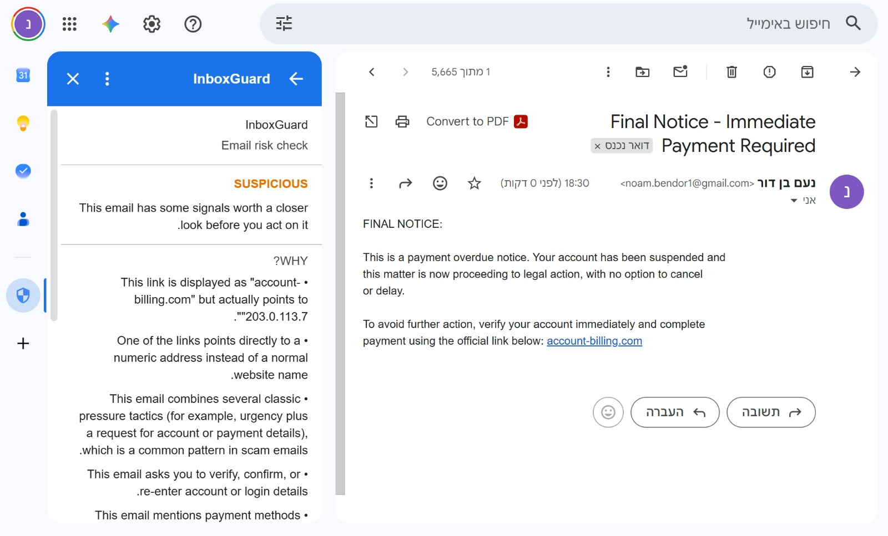
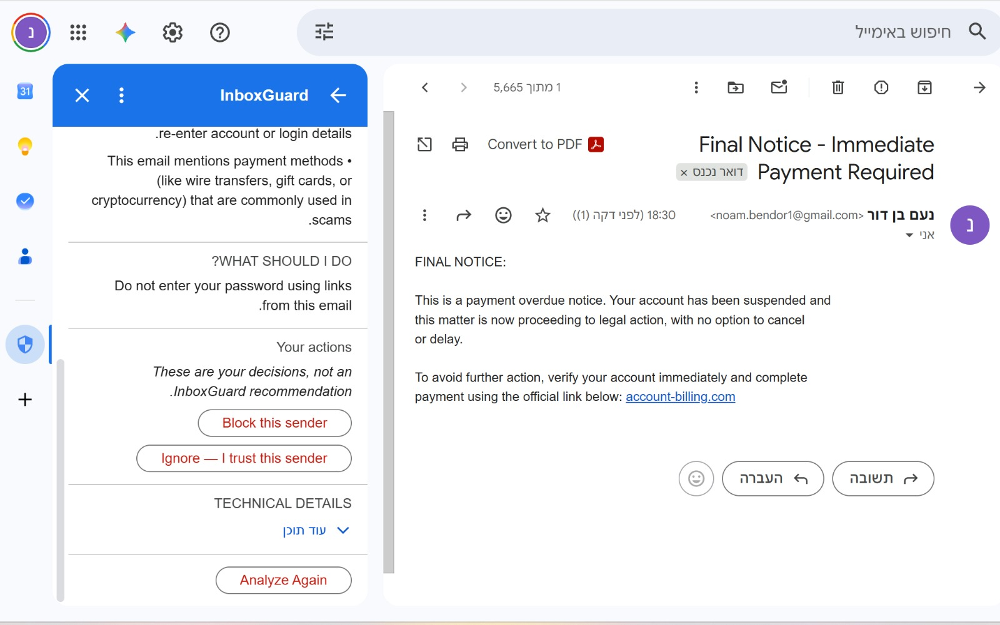
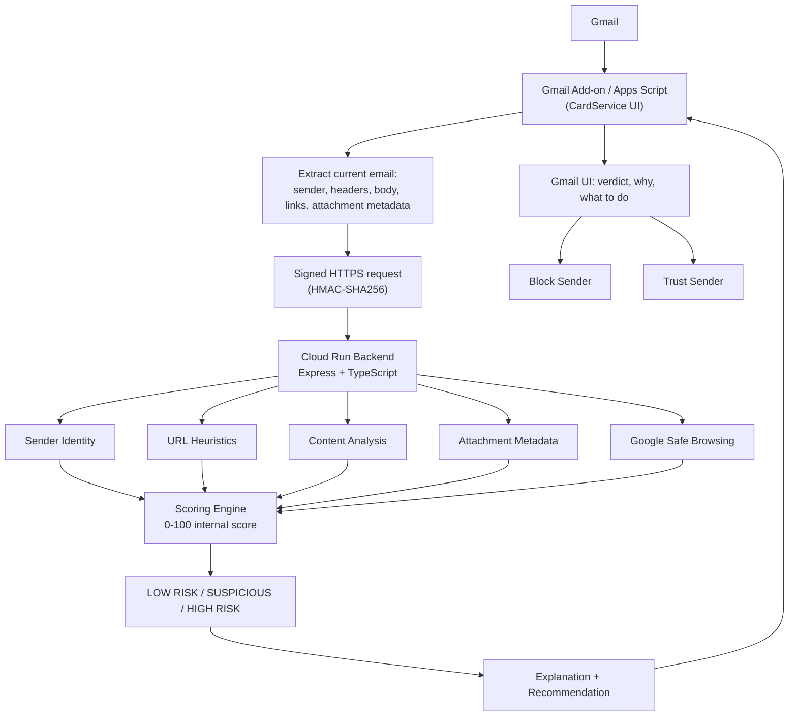

# InboxGuard

InboxGuard is a Gmail Add-on that looks at whatever email you currently have open and tells you, in plain language, whether it looks risky, why, and what to do about it. It is an MVP: a Google Apps Script Add-on (thin client) talking to a Node.js/TypeScript backend (all the actual analysis), with Google Safe Browsing folded in as one signal among several.

If you're preparing to talk about this project without a software engineering background, read [`docs/ARCHITECTURE_AND_DECISIONS.md`](docs/ARCHITECTURE_AND_DECISIONS.md) first — it explains every technical concept used here (SPF/DKIM/DMARC, HMAC, SSRF, Cloud Run, etc.) in plain English, decision by decision.

To actually demo the product on a real Gmail account, see [`docs/DEMO.md`](docs/DEMO.md).

---

## Quick Start

The condensed version, for anyone already comfortable with a command line, Google Cloud, and Apps Script. For literal, click-by-click beginner instructions (creating a Google Cloud project, enabling billing, creating a Safe Browsing key, etc.) use [`docs/DEPLOYMENT.md`](docs/DEPLOYMENT.md) instead.

### Prerequisites

Install these first (all free). After installing anything here, **close and reopen your terminal** before continuing — a terminal window opened before an install won't see the newly installed command, which looks like an error but isn't one.

| Tool | Check it's installed | Get it |
|---|---|---|
| Git | `git --version` | [git-scm.com/downloads](https://git-scm.com/downloads) |
| Node.js 20+ (includes npm) | `node --version` | [nodejs.org](https://nodejs.org) |
| Google Cloud CLI | `gcloud --version` | [cloud.google.com/sdk/docs/install](https://cloud.google.com/sdk/docs/install) — only needed for step 2 (deploying the backend) |

You'll also need a Google account with a Google Cloud project (billing enabled — Cloud Run's free tier makes this effectively free for a demo) and a Gmail account for step 3.

### Automated setup (Windows)

If you're on Windows, [`scripts/setup-windows.ps1`](scripts/setup-windows.ps1) does steps 1–3 below for you: it checks for Git/Node.js/gcloud and installs anything missing (via `winget`), deploys the backend, and pushes the Add-on. Run it from the repository root:
```powershell
.\scripts\setup-windows.ps1
```
It will still open a real browser window twice for you to sign into Google yourself (once for `gcloud`, once for `clasp`) — no script should ever do that silently on your behalf — and it can't create a Google Cloud project or attach billing for you, since Google requires that to be done by a human in the Cloud Console. Everything else is automatic; it prints the two remaining manual clicks (setting Script Properties, installing the test deployment) at the end. See the comments at the top of the script for details.

The steps below are the manual equivalent (also what to follow on macOS/Linux).

**1. Clone and verify the code works — no cloud account or the tools above needed for this step, only Git and Node.js:**
```bash
git clone https://github.com/noambendor1/InboxGuard.git
cd InboxGuard/backend
npm install
npm test
```
Expect `27 passed (27)`. This alone proves the analysis engine works correctly, independent of any deployment.

**2. Deploy the backend to Cloud Run:**
```bash
gcloud auth login
gcloud config set project YOUR_PROJECT_ID
gcloud services enable run.googleapis.com cloudbuild.googleapis.com artifactregistry.googleapis.com

gcloud run deploy inboxguard-backend \
  --source . \
  --region us-central1 \
  --allow-unauthenticated \
  --set-env-vars INBOXGUARD_SHARED_SECRET="$(openssl rand -hex 32)",SAFE_BROWSING_API_KEY="",MAX_REQUEST_AGE_SECONDS=300
```
Copy the printed **Service URL** and the secret you generated — both are needed in step 3. (Leaving `SAFE_BROWSING_API_KEY` empty is fine; see [`docs/DEPLOYMENT.md`](docs/DEPLOYMENT.md) Part B to add it later.)

**3. Install the Gmail Add-on:**
```bash
npm install -g @google/clasp@2.4.2
clasp login
cd ../addon
clasp create --type standalone --title "InboxGuard" --rootDir ./src
clasp push --force
```
> If `clasp create` writes `.clasp.json` inside `addon/src/` instead of `addon/`, move it up one level (`mv src/.clasp.json .`) before running `clasp push` — otherwise it looks for source files in a non-existent `src/src/` folder. Also prefer `clasp@2.4.2` specifically: newer `clasp` v3 releases have a known `Insufficient Permission` bug on `create`.

Then, in the Apps Script editor (`clasp open`): **Project Settings** → **Script Properties** → add `BACKEND_URL` (the Service URL from step 2) and `INBOXGUARD_SHARED_SECRET` (the same secret from step 2) → **Deploy** → **Test deployments** → **Install**.

**4. Try it:** open Gmail, open any email, then look at the vertical icon rail on the far-right edge of the window — the same strip as Calendar/Tasks/Keep. InboxGuard shows up there as a blue shield icon:


Click it to open the analysis panel.

---

## 1. Overview

When you open an email, InboxGuard's Gmail sidebar answers three questions:

1. **Does this email look risky?**
2. **Why?**
3. **What should I do?**

It shows one of three risk levels — **LOW RISK**, **SUSPICIOUS**, **HIGH RISK** — with a short, non-technical explanation of the top reasons, and a specific recommended action. You can then **block the sender** or tell InboxGuard **you trust this sender**.

InboxGuard is not just a detector. It's a decision-support tool: it converts a pile of technical security signals (SPF/DKIM/DMARC results, URL structure, Safe Browsing reputation, phishing language patterns, attachment metadata) into one simple verdict and one concrete next step.

**What it looks like** — a real, live-tested result (see `docs/DEMO.md` Scenario 3) for a payment scam email, showing the verdict and reasons on the left, and the recommended action, user actions, and technical details below:

<p>
  
  
</p>

---

## 2. Product decisions

**Why risk levels instead of a number.** A score like "82/100" implies a precision the system doesn't have — it looks like a calibrated probability, but it's really a weighted heuristic total. Showing LOW RISK / SUSPICIOUS / HIGH RISK instead communicates *exactly* as much certainty as the system actually has, and is something anyone can act on immediately without needing to know what "82" means.

**Why an internal numeric score still exists.** The backend still computes a 0–100 score internally. It's a useful, consistent way to combine many small signals, rank findings by importance, and pick a threshold — it's an implementation detail, not a promise to the user.

**Why explainability matters.** "HIGH RISK, trust us" is not useful and not verifiable. Every finding carries a plain-language explanation *and* a technical explanation, so the user can see exactly why InboxGuard reached its verdict.

**Why recommended actions matter.** Telling someone "this is risky" without telling them what to actually *do* leaves them stuck. InboxGuard always closes with one specific, actionable instruction tied to the strongest finding (e.g. "don't enter your password via this link," not "be careful").

**Why Safe Browsing is combined with local heuristics, not used alone.** Safe Browsing tells you if Google has already confirmed a URL is bad. It can't tell you about a URL created five minutes ago. Structural heuristics (IP-address hosts, punycode, shorteners, link-text/href mismatches, etc.) catch new phishing infrastructure that hasn't been indexed yet. Neither is sufficient alone.

**Why attachments are metadata-only.** Opening, executing, or uploading attachment content to a third party is itself a security risk and well outside the scope of an MVP. Filename, extension, MIME type, and size are already enough to catch the classic disguised-executable pattern (`invoice.pdf.exe`) without ever touching the file's bytes.

**Why no LLM is used in the MVP.** An LLM reading raw email content is a prompt-injection surface — an attacker who crafts the email body can try to manipulate the model itself. Deterministic, auditable rules have no such attack surface, are free to run, and are trivially testable (see `backend/tests`). See the trade-offs section and `docs/ARCHITECTURE_AND_DECISIONS.md` for more on prompt injection specifically.

**Why users can block a sender.** It's the obvious next action after "this is dangerous" — InboxGuard should help you act, not just inform you.

**Why users can mark a sender as trusted.** Reduces alert fatigue from recurring low-confidence noise (e.g. a personal domain that never sets up DMARC) without weakening detection.

**Why trusted-sender status never overrides strong signals.** A trusted contact's account can be compromised and used to send a real phishing link. If "trusted" suppressed all analysis, InboxGuard would become *less* safe for the accounts a user trusts most — exactly backwards. Trust only reduces the Add-on's own low-confidence noise; it never suppresses a confirmed Safe Browsing match, a dangerous attachment, or a strong content/link finding.

---

## 3. Architecture



**Gmail Add-on (`addon/`, Google Apps Script + CardService).** Deliberately thin. It reads the open email, extracts fields, signs a request, calls the backend, and renders the response as a card. It never makes a security decision itself.

**Backend (`backend/`, Node.js + TypeScript + Express, deployed to Cloud Run).** All analysis logic lives here: detectors, scoring, Safe Browsing integration, HMAC verification. Directory layout:

```
backend/src/
  routes/          # /health, /analyze (HTTP layer only)
  validation/       # Zod request schema
  auth/              # HMAC middleware
  middleware/       # security headers, request context, error handling
  analysis/
    detectors/       # sender, links, content, attachments
    analyzeEmail.ts  # orchestrator
    recommendation.ts
  safebrowsing/      # Safe Browsing client + finding builder
  scoring/           # score engine, risk-level thresholds, trust adjustment
  types/             # shared TypeScript types
backend/tests/       # Vitest suite (27 tests)
```

**Add-on (`addon/src/`):**

```
EmailExtractor.js      # reads GmailMessage -> plain JSON (no HTML execution)
HmacSigner.js           # signs requests with the shared secret
BackendClient.js        # calls the backend, handles failures gracefully
TrustedSenderStore.js   # per-user trust storage (PropertiesService)
CardBuilder.js          # all CardService UI
Actions.js               # Block / Trust / Untrust click handlers
Code.js                  # entry points wired up in appsscript.json
```

---

## 4. Scoring model

Four categories, each with its own maximum, summing to exactly 100:

| Category | Max points | What it looks at |
|---|---|---|
| Sender & Identity | 30 | SPF/DKIM/DMARC results, From/Reply-To mismatch, Return-Path mismatch, display-name brand impersonation |
| Links | 30 | HTTP vs HTTPS, IP-address hosts, punycode, shorteners, suspicious paths, link-text vs. href mismatch, **Google Safe Browsing** |
| Content | 20 | Keyword *groups*, in English and Hebrew (credential requests, urgency, payment/financial, threats, sensitive-info requests) — a combination bonus rewards multiple groups matching together |
| Attachments | 20 | Filename/extension, double extensions (`invoice.pdf.exe`), MIME/extension mismatch, archive files |

Each category's raw total is **capped at its maximum** before summing, so no single category (e.g. ten small link findings) can dominate the score through sheer volume, and the total can never exceed 100 by construction (30+30+20+20=100). See `backend/src/scoring/scoreEngine.ts`.

The final score maps to a risk level:

| Score | Risk level |
|---|---|
| 0–29 | LOW RISK |
| 30–59 | SUSPICIOUS |
| 60–100 | HIGH RISK |

**One override:** a confirmed Google Safe Browsing match always forces **HIGH RISK**, regardless of the numeric total, and this cannot be suppressed by a trusted-sender preference (see §6). A known, Google-confirmed malicious URL is categorically different from a heuristic guess — it deserves a hard floor, not a weighted vote.

**This score is not a probability.** It's a weighted sum of independent, deterministic rules, tuned by hand (documented above), not a calibrated statistical model. Two emails that both score "45" are not "45% likely to be phishing" — they simply tripped a comparable amount of heuristic weight. That's exactly why the UI only ever shows the three-level bucket, never the number.

---

## 5. Google Safe Browsing

**What it checks.** For every unique URL found in an email, the backend batches a lookup against Google Safe Browsing's [`threatMatches:find`](https://developers.google.com/safe-browsing/v4/lookup-api) endpoint, checking for malware, social engineering (phishing), unwanted software, and potentially harmful applications.

**Why it's valuable.** It's Google's own, constantly-updated database of confirmed-bad URLs — a strong, low-false-positive signal when it hits.

**Why it's treated as a strong signal.** A positive match isn't a guess; it's a confirmed record. That's why it overrides the numeric score entirely (see §4).

**Why no match does NOT mean "safe."** Safe Browsing only knows about URLs it has already seen and classified. Freshly-registered phishing domains, one-off spear-phishing links, and infrastructure rotated faster than crawlers can catch up will all come back clean — a genuine gap, not a bug. That's why InboxGuard always runs local URL heuristics too, and a "no match" result is never surfaced to the user as a positive safety claim.

**Failure handling.** Safe Browsing calls have a 3-second timeout and are wrapped in try/catch. Any timeout, network error, non-2xx response, or quota error results in the analysis continuing with local heuristics alone; the user sees a neutral note ("Link reputation check was unavailable") instead of a broken feature or a leaked API error. See `backend/src/safebrowsing/safeBrowsingClient.ts`.

**Note on production use.** This project uses the Safe Browsing API (v4) for this demo because it's simple, free at low volume, and well documented. A production/commercial deployment should evaluate Google's [Web Risk API](https://cloud.google.com/web-risk) instead, which is the product Google positions for commercial integrations, and review its licensing terms.

---

## 6. User trust model

Users can mark a sender as trusted ("Ignore — I trust this sender"). This is stored **per Gmail user**, in Apps Script's `PropertiesService.getUserProperties()` — never a shared or global allowlist (see `addon/src/TrustedSenderStore.js`).

Trusting a sender is a **usability signal**, not a security bypass:

- It **can** suppress the Add-on's own *low-confidence* sender-identity noise — e.g., a minor Return-Path mismatch, or "no authentication headers were available" — the kind of finding that's more often a false positive on legitimate senders than a real threat.
- It **never** suppresses a confirmed Safe Browsing match, a dangerous attachment, a severe authentication failure (DMARC fail), or a strong content/link finding.

This matters because **a legitimate contact's account can be compromised**. If `alice@example.com` is trusted and her account is later hijacked and used to send a known-malicious link, InboxGuard still shows **HIGH RISK**, with a message that makes the tension explicit: *"You previously trusted this sender, but this message contains strong security risks."* The trust note itself is deliberately understated in the UI and never rendered more prominently than the verdict.

Users can undo trust at any time ("Remove from trusted senders").

---

## 7. Blocking a sender

When you click **Block this sender**, InboxGuard shows a confirmation screen before doing anything — this is a one-way action worth a deliberate pause.

**An important limitation, stated plainly rather than assumed away:** Gmail's own native "Block sender" menu action (the one in the "⋮" menu on a message) is not exposed through any public Gmail API or Apps Script method. No third-party Add-on can trigger that exact built-in feature. Rather than silently do nothing, or worse, claim success without actually blocking anything, InboxGuard uses the closest real, documented, supported capability instead: the Gmail API's mail-filter feature (`users.settings.filters.create`) to create a filter that automatically sends all future messages from that address straight to Trash. For day-to-day purposes this produces the same outcome a user actually cares about — that sender's mail stops reaching the inbox — through a mechanism that genuinely exists.

- **Confirmation first**, every time — no one-click destructive action.
- **Honest success/failure.** If Gmail rejects the filter creation (permissions, quota, transient error), InboxGuard shows a clear failure message. It never reports "Sender blocked" unless the filter was actually created.
- **Least-privilege scope.** This uses only the `gmail.settings.basic` OAuth scope — not full mailbox read/write access.

See `addon/src/Actions.js` for the implementation, and `docs/ARCHITECTURE_AND_DECISIONS.md` §5 for the full reasoning behind choosing this fallback over pretending a native block API exists.

---

## 8. Explainability

Every signal the detectors find becomes a structured `Finding`:

```ts
{
  id, category, severity, scoreContribution,
  userTitle, userExplanation,       // plain language, shown in the main UI
  technicalExplanation,              // shown only in "Technical details"
  recommendedAction
}
```

Findings are sorted by severity/importance; the UI shows the top ~5 prominently under "WHY?" and the full list (with technical explanations) in a collapsible "Technical details" section. The top-level recommended action is chosen from the single highest-priority finding present (see `backend/src/analysis/recommendation.ts` for the exact priority order — e.g. a confirmed malicious link always outranks a soft urgency-language finding).

---

## 9. Security & privacy

- **Untrusted input.** The entire email (sender, headers, subject, body, links, attachment metadata) is treated as attacker-controlled. Zod validation enforces strict shapes and length caps on every field (`backend/src/validation/analyzeRequest.ts`); the HTTP body is capped at 256KB.
- **No email HTML is ever rendered or executed**, by the Add-on or the backend. The Add-on uses Gmail's own plain-text rendering (`getPlainBody()`) for content analysis and a narrow, non-executing regex scan of the raw HTML only to pull out `(href, link text)` pairs.
- **No arbitrary URL fetching / no SSRF.** InboxGuard never visits a URL contained in an email. The only outbound call the backend ever makes is to Google's Safe Browsing endpoint, with the URLs sent as data in a POST body — not fetched.
- **No attachment execution.** Only filename/MIME type/size are read; contents are never opened, unpacked, or uploaded.
- **HMAC-SHA256 request authentication** between the Add-on and the backend (see below).
- **No message persistence.** Analyzed emails are never written to a database or disk. There is no database in this project.
- **No content logging.** Backend logs never include email body, subject, sender address, links, or attachment filenames — only operational metadata (request ID, duration, HTTP status, risk level, finding count, URL count, whether Safe Browsing succeeded).
- **Generic error messages.** Raw exceptions and stack traces are never sent to the client; `backend/src/middleware/errorHandler.ts` always returns a friendly message plus a request ID for correlation.
- **Secrets stay server-side.** The Safe Browsing API key is a Cloud Run environment variable, read only by the backend, never sent to the Add-on, never logged. The shared HMAC secret lives in Apps Script Script Properties and the Cloud Run environment — never in source control (`.env.example` documents the shape without values; `.gitignore` excludes `.env`).
- **Least-privilege OAuth scopes.** The Add-on requests only: current-message read access (not full mailbox), Gmail settings (for the filter-based block fallback), and external-request access (to call the backend). It does not request full Gmail read/write access.
- **Secure HTTP headers** (`X-Content-Type-Options`, `X-Frame-Options`, `Referrer-Policy`, a restrictive `Content-Security-Policy`) since this is a pure JSON API with no HTML surface of its own.

### HMAC request authentication (Add-on → backend)

The Add-on signs every request: `HMAC-SHA256(sharedSecret, timestamp + "." + requestBody)`, sent as `X-InboxGuard-Timestamp` and `X-InboxGuard-Signature` headers. The backend:

- rejects requests with missing signature headers,
- rejects invalid signatures (compared with `crypto.timingSafeEqual`, not `===`, to avoid timing side-channels),
- rejects timestamps older than ~5 minutes (replay protection window),
- never logs the secret.

**This is a pragmatic demo mechanism**, not a production-grade design. It uses a single long-lived static secret shared between two systems, and its replay protection is only a time window (no nonce cache, so a captured request could technically be replayed within that window). A production system should prefer either:
- Cloud Run's built-in IAM authentication (`--no-allow-unauthenticated`) combined with Apps Script's `ScriptApp.getIdentityToken()` to obtain a short-lived, Google-signed OIDC token per request, verified against Google's public keys — no shared secret to leak, ever; or
- a nonce-based replay cache in addition to the timestamp window, and periodic secret rotation.

---

## 10. Trade-offs

- **Deterministic heuristics vs. ML/LLM.** Chosen for auditability, zero inference cost, instant explainability, and zero prompt-injection surface. Trade-off: it won't catch novel phishing patterns that don't match any rule, and rules need manual tuning over time.
- **Safe Browsing (known threats) vs. new/zero-day threats.** Strong on confirmed threats, blind to brand-new infrastructure — mitigated, not solved, by local heuristics.
- **Explainability vs. detection sophistication.** A more opaque ML classifier might catch more, but "trust me" is a worse UX for a security tool than a slightly-less-sophisticated system the user can actually verify.
- **Metadata-only attachments vs. real scanning.** Catches the classic disguised-executable pattern; misses genuinely malicious content hidden inside an innocuously-named, correctly-typed file. A real sandbox/AV scan is future work.
- **Trusted-sender convenience vs. compromised-account risk.** Solved by never letting trust suppress high-confidence findings (§6) — convenience only ever reduces noise, never coverage.
- **HMAC demo auth vs. production auth.** Simple to implement and explain; weaker than OIDC/IAM-based auth (see §9). Fine for this MVP; documented as a known gap.
- **No LLM.** See §2 and `docs/ARCHITECTURE_AND_DECISIONS.md` for the prompt-injection reasoning specifically.
- **Language coverage.** The content-analysis keyword groups currently cover English and Hebrew. An email using social-engineering language in another language won't trigger content-based findings, though sender-identity, link, and Safe Browsing checks are language-independent and still run normally.

---

## 11. Running locally

Requires Node.js 20+.

```bash
cd backend
npm install
cp .env.example .env
# edit .env: set INBOXGUARD_SHARED_SECRET to any random string for local testing.
# leave SAFE_BROWSING_API_KEY empty to run without Safe Browsing locally.
npm run dev
```

The server starts on `http://localhost:8080` (or `PORT` from `.env`). `GET /health` should return `{"status":"ok"}` without authentication; `POST /analyze` requires a valid HMAC signature (see `backend/tests/httpIntegration.test.ts` for a working example of signing a request in Node).

## 12. Running tests

```bash
cd backend
npm test        # run once
npm run test:watch
npm run lint
npm run format:check
npm run build    # TypeScript compile check
```

27 Vitest tests cover: normal/phishing/benign-urgent email classification, From/Reply-To mismatch, failed auth headers, punycode URLs, link-text/href mismatch, disguised attachments, empty/malformed-URL inputs without crashing, Safe Browsing positive/clean/unavailable responses (mocked — no live API calls in tests), five trusted-sender scenarios (including the compromised-trusted-sender case), scoring invariants (never exceeds 100, category caps respected, deterministic output), and an HTTP-layer suite covering the HMAC auth middleware (missing/invalid/stale signatures, valid signed request end-to-end).

---

## 13. Deployment

Full beginner-friendly walkthrough (Google Cloud project setup, enabling APIs, creating the Safe Browsing key, clasp/Apps Script setup) is in [`docs/DEPLOYMENT.md`](docs/DEPLOYMENT.md). Short version, once you have a Google Cloud project with billing enabled:

```bash
cd backend
gcloud config set project YOUR_PROJECT_ID
gcloud services enable run.googleapis.com cloudbuild.googleapis.com artifactregistry.googleapis.com

gcloud run deploy inboxguard-backend \
  --source . \
  --region us-central1 \
  --allow-unauthenticated \
  --set-env-vars INBOXGUARD_SHARED_SECRET="YOUR_SECRET",SAFE_BROWSING_API_KEY="YOUR_SAFE_BROWSING_KEY",MAX_REQUEST_AGE_SECONDS=300
```

Copy the printed Service URL — you'll paste it into the Add-on's `BACKEND_URL` Script Property.

## 14. Gmail Add-on installation

Full beginner walkthrough (installing clasp, logging in, enabling the Apps Script API, pushing code, setting Script Properties, installing a test deployment) is in [`docs/DEPLOYMENT.md`](docs/DEPLOYMENT.md).

Want someone else to try *your* installation instead of deploying their own? See [`docs/DEPLOYMENT.md`](docs/DEPLOYMENT.md) Part D — sharing a test deployment with specific people takes minutes; a real public listing on the Google Workspace Marketplace requires Google's OAuth verification review (2–6 weeks), since InboxGuard requests a sensitive scope.

## 15. Demo script

See [`docs/DEMO.md`](docs/DEMO.md) for five ready-to-send sample emails and a 3–5 minute demo flow.

## 16. Future improvements

- Google Web Risk API for a commercial-grade threat intelligence tier
- Domain reputation / domain age signals
- Broader language coverage for the content-analysis keyword groups beyond English and Hebrew
- Sandboxed attachment scanning (opt-in, with clear consent)
- A machine-learning classifier layered on top of (not replacing) the deterministic rules, with the rules as a fallback/explainer
- Organization-specific policies (admin-configured thresholds, allowlists)
- False-positive feedback loop to tune rule weights over time
- A proper trust-management screen (list/remove all trusted senders at once)
- Org-wide admin policies (Workspace domain-level configuration)
- An optional LLM explanation layer that only ever summarizes the *structured findings* InboxGuard already computed — never raw email content — to avoid reintroducing a prompt-injection surface while still improving the prose
- Publishing to the Google Workspace Marketplace for real public distribution, once ready to invest in Google's OAuth verification review (see `docs/DEPLOYMENT.md` Part D)

---

## Project structure

```
/
  addon/            Gmail Add-on (Google Apps Script + CardService)
    src/
  backend/           Node.js + TypeScript backend (Express, deployed to Cloud Run)
    src/
    tests/
  docs/
    ARCHITECTURE_AND_DECISIONS.md   Plain-language deep dive, no CS background assumed
    DEPLOYMENT.md                    Full beginner-friendly deployment walkthrough
    DEMO.md                          Sample emails + demo script
  scripts/
    setup-windows.ps1                Automated setup (installs prerequisites, deploys, pushes the Add-on)
  README.md          This file
```
